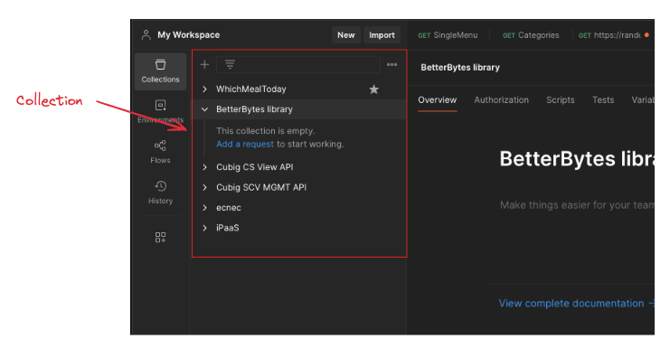
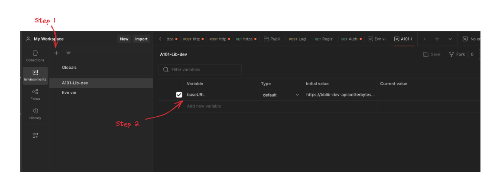
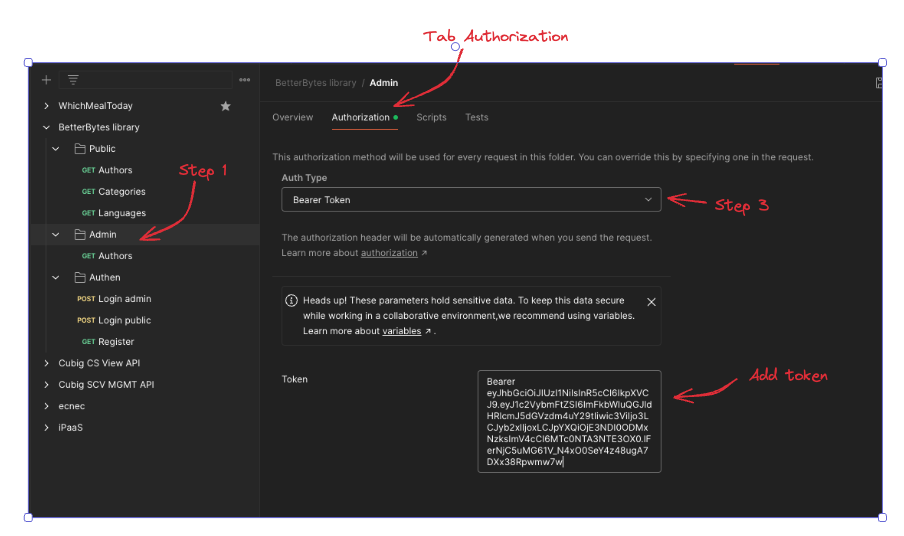
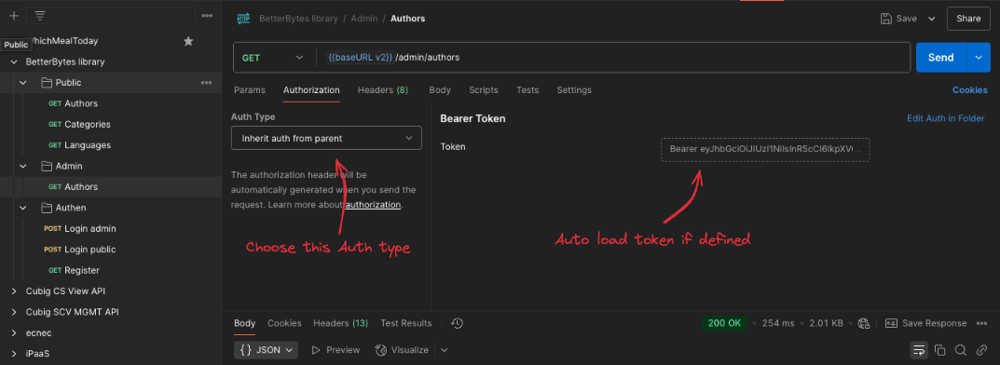

# Postman advanced part 1

## Swagger API doc
Document danh sách API trong hệ thống

## Collection
Là một tập hợp req, cho phép sử dụng lại các req đã có, giúp tự động chạy req và share cho người khác.
Cho phép đặt tên cho từng Req trong collection nhằm tăng tính nhận diện

Chức năng Export: chọn version 2.1 -> cho ra một file JSON lưu thông tin chi tiết về collection -> share cho người khác

## Variables
Là cách lưu trữ một thông tin dùng đi dùng lại nhiều lần, 
    - truy cập bất cứ lúc nào
    - cho phép chạy toàn bộ API trong collection mà ko cần chạy lẻ từng API req

- Initial Value: giá trị khởi tạo của biến môi trường => nếu share thì tự set giá trị khi import vào Postman
- Curent Value: giá trị hiện tại của biến
- Type của biến: default / secret ( biến value thành dạng dấu * - ẩn hiển thị)

Chạy auto: cho phép cài đặt các thông số, thứ tự chạy của API, số lần chạy, thời gian chạy,...

Setup token chạy cho cả collection nhằm giảm thời gian sửa token trong từng req đơn lẻ
> Trong Collection

> Trong API req

## Viết test case cho API
Mẫu tài liệu test case (gồm các cột):
- ID: Mã test
- Name: mô tả ngắn
- Precondition: điều kiện trước khi chạy
- Input: dữ liệu đầu vào
- Test step: các step chạy
- Expected result: Kết quả mong muốn
- Actual: kết quả thực tế
- Status: test fail hay pass
- Note: note

Các bước tạo test case
- Đọc tài liệu API
- Phân tích API
- Viết test theo checklist (function, status code, data validation, authen/author)
- Review testcase

## Javascript loop
- Giúp thực hiện một đoạn code nhiều lần dựa theo một điều kiện nhất định