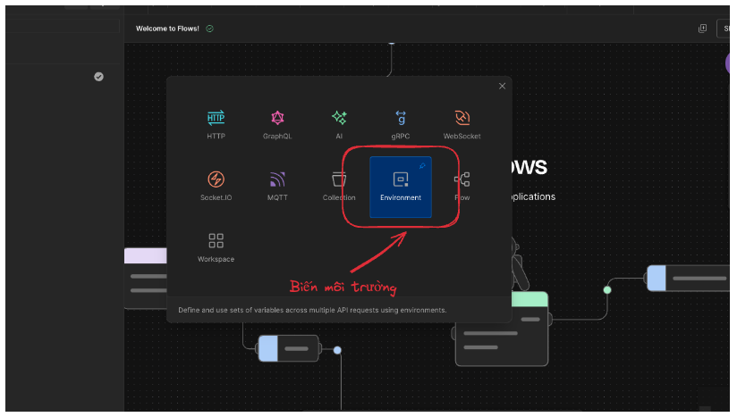
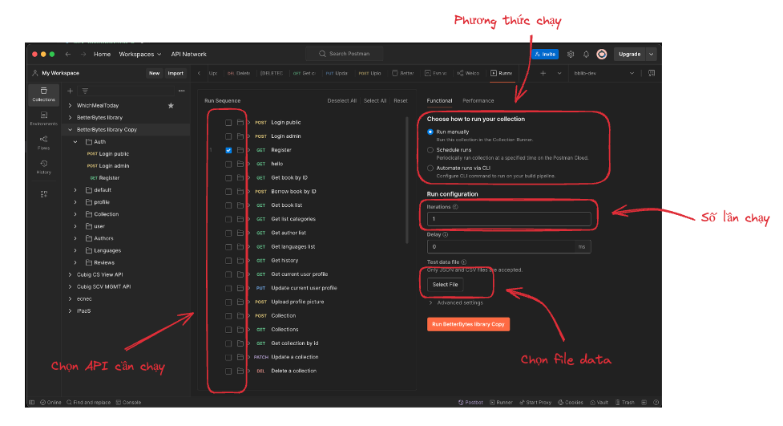
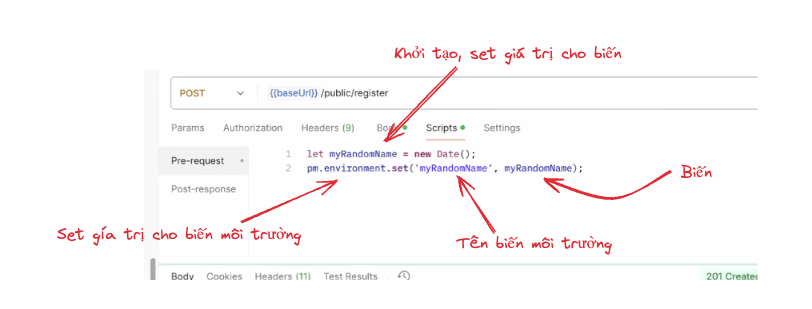
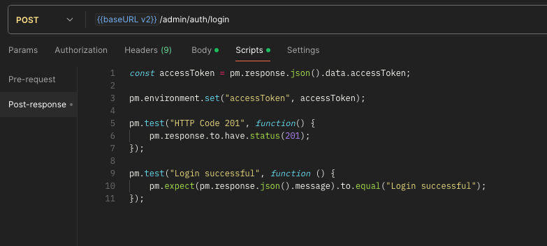
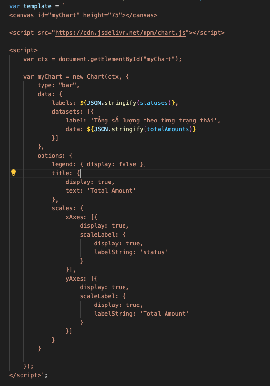
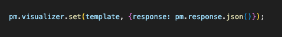

# POSTMAN advanced

## Scope của biến trong POSTMAN

- Biến Global: Cho khả năng truy cập trên toàn bộ postman ( không phân biệt môi trường, collection)

- Biến môi trường: Cho khả năng truy cập trên từng môi trường


- Biến Collection: Cho phép truy cập trong cùng một collection

- Biến Data: Biến từ file dữ liệu khi chạy collection

- Biến Local: biến tạm thời, tồn tại trong một script hoặc 1 req cụ thể

Ưu tiên truy cập: local > data > env > Collection > Global

### Chạy batch request từ CSV file



- Ứng dụng:
  - Chạy nhiều request với nhiều dữ liệu một cách nhanh chóng

### Dynamic variable

Một số biến có sẵn của postman dùng để sinh ra dữ liệu động
Sử dụng: `{{$var}}`

Tham khảo: variable-list // postman

## POSTMAN scripts - Kịch bản

### Vòng đời của req

- pre-req ->  Client -> Server -> Client -> post res

#### Pre-request
- Script sử dụng để thực hiện các thao tác trước khi gửi request



```javascript
// pre-req
const accessToken = pm.environment.get("accessToken");
if(!accessToken){
    pm.sendRequest({        
        url: "https://api.postman.com/oauth2/token",
        method: "POST",
        header: {
            "Content-Type": "application/json"
        },
        body: {
            mode: "raw",
            raw: JSON.stringify({
                "username": "nguyenvanhoa123456789@gmail.com",
                "password": "123456"
            })
        }    
    }, function (err, res) {        
        if(err){
            console.log(err);        
        }
        const data = res.json();
        pm.environment.set("accessToken", data.access_token);
    }
);
```

#### Post-response
- Script sử dụng để thực hiện các thao tác sau khi nhận response
- Thường dùng để thực hiện set biến môi trường, viết test kiểm thử response data.



- Một số function thường dùng của postman cho post-response:
    pm.response: lấy response
    pm.test: thực hiện test kiểm thử
    pm.expect: expect data ( ~assert trong Java unit test)
    pm.visualizer: dùng để tạo template để hiển thị kết quả

## Visualization
Tạo template ( dạng html)


Lấy dữ liệu từ response
Set cho template với pm.visualizer.set('template', data);
